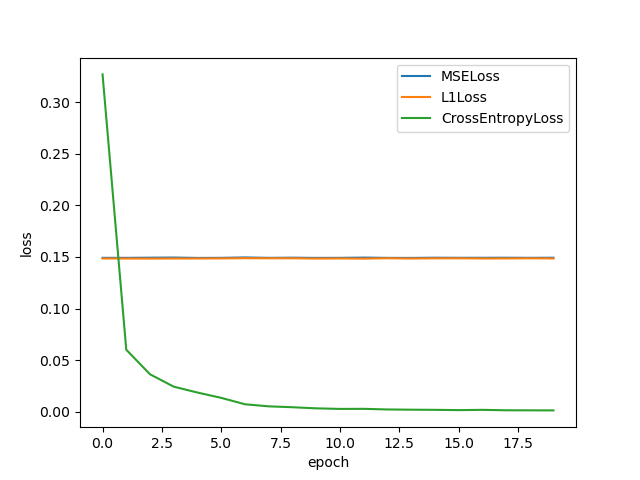

# `SmartSystem_Lab1.2`

##### 18307130251 蒋晓雯

###### 有能力的同学可以进一步查询相关资料，使用一些方法改进网络，提高精度。

###### 编写实验文档，可以包括但不限于:

- ###### 代码基本结构

- ###### 设计实验改进网络并论证

- ###### 对网络设计的理解

###### 提交: 将所有代码、文档放在 学号-姓名 文件夹下，打包上传到`WORK_UPLOAD/LAB1/PART2` 目录下。

## 1 代码基本结构

### 卷积网络 `src/CNN_network.py`

设置了两个隐藏层。

### 加载数据 `src/load_data.py`

```python
torchvision.datasets.ImageFolder
```

使用`torchvision`加载训练集和开发集的数据。先将图片转化为灰度图再转为张量。

训练集进行混洗，开发集不混洗。

开发集和训练集都是`train`里面的图片，一大部分作为训练集，一小部分划为开发集用作检查网络的准确性。

### 训练网络 `src/main.py`

1. 加载训练集和开发集的数据，设置损失函数和优化器

2. 每一个epoch中对于训练集中的数据，分批进行：

   - 梯度清零
   - 正向传播，用网络当前的权重得到预测结果
   - 用机器预测结果和理想分类结果过损失函数，得到loss
   - 通过loss对网络进行反向传播，调整网络的权重
   - 用优化函数根据网络反向传播的梯度信息来更新网络的参数，以起到降低loss函数计算值的作用
   - 累加当前批次的loss

3. 一个epoch结束之后，用当前网络的权重测试开发集中图片分类的正确率和loss，输出；同时也输出训练集当前epoch的loss和分类正确率

4. 存每个epoch训练集和开发集的loss和正确率

5. 训练结束之后，保存网络和网络参数

6. 用上面存的loss和正确率数据画图

   ###### *7.可以重新加载网络来测试别的测试集，由于没有新的数据，我这里是测试的还是我的开发集

## 2 设计实验改进网络并论证

### 2.1 损失函数

对比了三种常用的损失函数：`MSELoss`、`L1Loss`、`CrossEntropyLoss`。

其中`MSELoss`和`L1Loss`都是以`one-hot`的输出来计算损失的，而交叉熵是的每一个分类的输出是该分类的概率。

<center>
    
    
</center>
<center><strong>图 1 - 不同损失函数效果对比</strong></center>

可以看出，交叉熵的效果最好，loss收敛的速度最快，分类正确率也远高于另外两个。

#### 结论

交叉熵明显优于其他。

### 2.2 优化函数

对比了八种常用的优化函数：`SGD`、`SGD+Momentum`、`SGD+Momentum+Nesterov`、`Adagrad`、`Adadelta`、`RMSprop`、`Adam`、`Adamax`

其中`SGD+Momentum`、`SGD+Momentum+Nesterov`是`SGD`的改善版，

`Adadelta`、`RMSprop`、`Adam`是`Adagrad`的改善版，

`Adamax`是`Adam`的改善版。

`Adamax`比`Adam`增加了一个学习上线的概念。

<center>
    
    
    
    
</center>
<center><strong>图 2 - 不同优化函数效果对比(左-训练集、右-开发集)</strong></center>

两个较为基础的优化函数`SGD`和`Adagrad`效果显著差于其他更加完善的版本。

虽然`Adam`在训练集上的表现很好，但是在开发集上，经过多次迭代之后，loss竟然有明显的上升的趋势。

#### 结论

在开发集上，对于正确率和loss都表现最好的是`Adamax`。

### 2.3 batch_size 和 learning rate

<center>
    
    
</center>
<center><strong>图 3 - batchsize=5时开发集相关数据</strong></center>

<center>
    
    
</center>
<center><strong>图 4 - batchsize=2时开发集相关数据</strong></center>

<center>
    
    
</center>
<center><strong>图 5 - batchsize=1时开发集相关数据</strong></center>

#### 结论

batch_size=1，learning_rate=0.01时最佳。在第6个epoch和第10个epoch时峰值达到过99.167%。

### 2.4 正则化

因为我本来就是正则化处理过的，这个对比一下去掉正则化的情况。由于我的网络是有两个隐藏层的，我对比只对第一层正则化，只对第二次正则化和不正则化的网络各是什么效果。

<center>
    
    
</center>
<center><strong>图 6 - 正则化对比实验</strong></center>

可以看到没有完全经过正则化的红线，不仅在最开始的几次迭代中，显著的表现很差之外，loss过早的从底部反弹，趋势不再收敛。

而只有一层隐藏层正则化的网络，只有第一层正则化的网络表现比只有最后一层隐藏层正则化的网络效果要来的差。

#### 结论

每一层隐藏层都正则化，网络效果最好。

### 2.5 图片处理

<center>
    
    
</center>
<center><strong>图 6 - 正则化对比实验</strong></center>

### 2.6 网络结构


## 3 对网络设计的理解

卷积神经网络，简单来说就是要顺序执行卷积，激活，池化，最后将最后一层隐藏层提取的特征，线性变换得到最后的分类输出。

隐藏层的层数，各层的神经元个数，卷积的窗口大小，移动的步长，池化的窗口大小，移动的步长，以及是否进行正则化都会对网络的实际效果产生影响。

要想设计出好的网络，网络的学习率，batch_size，以及以上的各个因素都要综合考虑。


### 


#### 参考博文

6种优化函数

https://blog.csdn.net/qq_36589234/article/details/89330342

10种优化函数

https://blog.csdn.net/u011995719/article/details/88988420?utm_medium=distribute.pc_relevant_t0.none-task-blog-BlogCommendFromMachineLearnPai2-1.edu_weight&depth_1-utm_source=distribute.pc_relevant_t0.none-task-blog-BlogCommendFromMachineLearnPai2-1.edu_weight